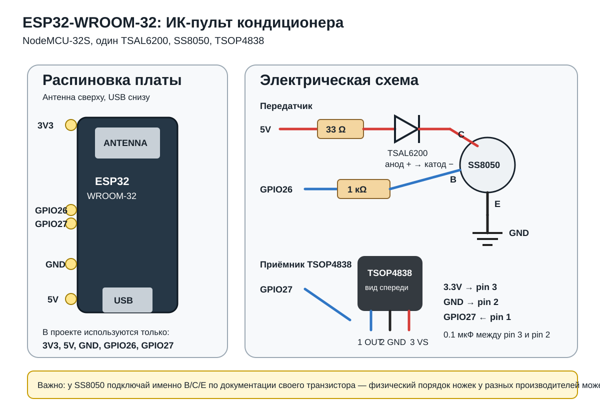

# ESP32 Telegram пульт для кондиционера

Пульт для кондиционера на ESP32-WROOM-32 / NodeMCU-32S с протоколом `ELECTRA_AC`.

ESP32:
- отправляет команды кондиционеру через TSAL6200 + SS8050;
- постоянно слушает штатный пульт через TSOP4838 и синхронизирует последнее известное состояние;
- управляется из Telegram кнопками;
- принимает текстовые команды вида `SET 23 COOL LOW`;
- хранит последнее состояние во внутренней памяти и восстанавливает его после перезагрузки.



## Подключение

Используемые выводы ESP32:

| Узел | ESP32 |
|---|---|
| ИК-передатчик | GPIO26 |
| TSOP4838 OUT | GPIO27 |
| TSOP4838 питание | 3.3V |
| TSOP4838 земля | GND |
| TSAL6200 питание | 5V через 33 Ом |

Передатчик:

`5V -> 33 Ом -> анод TSAL6200 -> катод -> коллектор SS8050 -> эмиттер -> GND`

`GPIO26 -> 1 кОм -> база SS8050`

Приёмник TSOP4838, если смотреть на приёмное окно спереди:

`1 OUT -> GPIO27`, `2 GND -> GND`, `3 VS -> 3.3V`.

Рекомендуется поставить керамический конденсатор `0.1 мкФ` между VS и GND рядом с TSOP4838.

> Распиновку ножек конкретного SS8050 проверьте по его документации: у разных производителей порядок E/B/C может отличаться.

## Что установить в Arduino IDE

1. Пакет плат: **esp32 by Espressif Systems**.
2. Плата: **NodeMCU-32S** (если её нет — `ESP32 Dev Module`).
3. Библиотека **IRremoteESP8266**.
4. Библиотека **UniversalTelegramBot**.
5. Библиотека **ArduinoJson** (зависимость Telegram-библиотеки).

Проект рассчитан на уже проверенный у данного кондиционера протокол `ELECTRA_AC` (104 бита).

## Настройка Telegram и Wi-Fi

Откройте папку `firmware/condition_telegram` и скопируйте:

`secrets.example.h` -> `secrets.h`

В `secrets.h` укажите Wi-Fi, токен Telegram-бота и разрешённый `chat_id`.

Токен создаётся через BotFather. Если свой `chat_id` неизвестен, временно оставьте `ALLOWED_CHAT_ID` пустым, прошейте ESP32 и отправьте боту `/id`. Управление при пустом `ALLOWED_CHAT_ID` заблокировано; команда `/id` остаётся доступной. Затем впишите полученный ID и прошейте ещё раз.

`secrets.h` добавлен в `.gitignore`, поэтому пароль и токен не попадут в GitHub.

## Telegram-пульт

Команда `/remote` открывает кнопочный пульт:

- питание;
- температура `-1 / +1`;
- COOL / HEAT / AUTO / DRY / FAN;
- Fan AUTO / LOW / MED / HIGH;
- Swing V / Swing H;
- Display (переключение табло);
- Turbo / Quiet;
- Status.

`/status` показывает последнее известное состояние.

## Текстовые команды

Основной формат:

```text
SET 23 COOL LOW
SET 25 HEAT AUTO
SET 22 DRY LOW
```

`SET` сразу отправляет **одно полное состояние кондиционера**, а не несколько команд подряд. `SET` также включает кондиционер.

Режимы:

`AUTO`, `COOL`, `DRY`, `HEAT`, `FAN`

Скорость вентилятора:

`AUTO`, `LOW`, `MED`, `HIGH`

Дополнительно можно передать параметры:

```text
SET 23 COOL LOW SV=ON SH=OFF
SET 25 HEAT AUTO SV=ON TURBO=OFF QUIET=ON
```

Поддерживаются также:

```text
ON
OFF
DISPLAY
STATUS
```

## Синхронизация со штатным пультом

TSOP4838 работает постоянно. Когда штатный пульт отправляет пакет `ELECTRA_AC`, ESP32 принимает все 13 байт состояния, обновляет локальное состояние и сохраняет его во внутреннюю память.

Это **последнее известное состояние**, а не обратная связь от внутреннего блока: сам кондиционер по ИК состояние обратно не передаёт.

Кнопка Display в этом протоколе является командой-переключателем. ESP32 после её передачи сбрасывает служебный флаг, чтобы следующая обычная команда случайно не переключила табло ещё раз.
